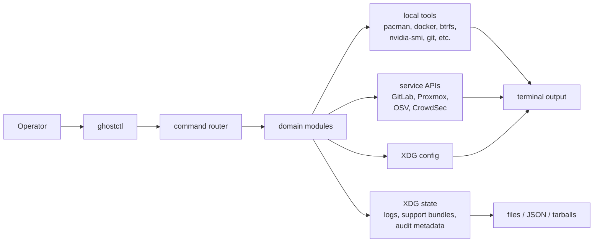

# GhostCTL Documentation

GhostCTL is a Linux administration CLI for system maintenance, infrastructure
operations, security auditing, developer environments, and support diagnostics.
This index is the canonical map for the documentation under `docs/`.

## Start Here

| Document | Use It For |
|----------|------------|
| [Installation Guide](deployment/INSTALL.md) | Install methods, package builds, platform notes |
| [Architecture Overview](architecture.md) | Runtime shape, command flow, safety boundaries, release gates |
| [Command Reference](reference/COMMANDS.md) | Full generated CLI command reference |
| [Support Bundles](support/README.md) | Diagnostics, redaction, issue artifacts |
| [Advisories](advisories/README.md) | Hotfix notes, accepted risks, resolved advisory history |

## Documentation Map

```mermaid
flowchart TD
    start["New user, operator, maintainer,\nor issue reporter"] --> install["deployment/INSTALL.md"]
    start --> architecture["architecture.md"]
    start --> commands["reference/COMMANDS.md"]
    start --> support["support/README.md"]
    start --> advisories["advisories/README.md"]

    commands --> system["System management"]
    commands --> infra["Infrastructure"]
    commands --> security["Security and audit"]
    commands --> observability["Monitoring and support"]
    commands --> dev["Development tools"]
    commands --> desktop["Desktop and media"]

    system --> arch["arch/*"]
    system --> btrfs["btrfs/*"]
    system --> nvidia["nvidia/*"]
    system --> storage["storage/*"]
    system --> uefi["uefi/README.md"]
    system --> virt["virtualization/*"]

    infra --> docker["docker/*"]
    infra --> proxmox["proxmox/*"]
    infra --> gitlab["gitlab/gitlab.md"]
    infra --> openshell["openshell/openshell.md"]

    security --> secindex["security/README.md"]
    security --> signing["signing/*"]
    security --> deps["security/dependency-audit.md"]
    security --> ci["security/ci-workflow-audit.md"]
    security --> package["security/package-audit.md"]
    security --> crowdsec["security/crowdsec.md"]

    observability --> monitor["monitor/monitoring.md"]
    observability --> support

    dev --> development["development/*"]
    dev --> gaming["gaming/README.md"]

    desktop --> obs["obs/wayland-screencapture.md"]
```

## Runtime Shape

## Complete Index

### Core

| Document | Description |
|----------|-------------|
| [architecture.md](architecture.md) | Command architecture, safety model, release gate shape |
| [index.md](index.md) | Alternate simple docs index |
| [reference/COMMANDS.md](reference/COMMANDS.md) | Generated command reference |

### Release and Advisories

| Document | Description |
|----------|-------------|
| [advisories/README.md](advisories/README.md) | Advisory and hotfix index |
| [advisories/accepted.md](advisories/accepted.md) | Accepted risks and watch items |
| [advisories/resolved.md](advisories/resolved.md) | Resolved advisory record |
| [advisories/v0.12.1-hotfix-notes.md](advisories/v0.12.1-hotfix-notes.md) | v0.12.1 dependency and workflow hotfix evidence |
| [deployment/INSTALL.md](deployment/INSTALL.md) | Install, package build, and release packaging flow |

### System Management

| Document | Description |
|----------|-------------|
| [arch/README.md](arch/README.md) | Arch module overview |
| [arch/aur.md](arch/aur.md) | AUR workflows |
| [arch/mirrors.md](arch/mirrors.md) | Mirror management |
| [arch/pacman.md](arch/pacman.md) | Pacman workflows |
| [arch/troubleshooting.md](arch/troubleshooting.md) | Arch troubleshooting |
| [btrfs/README.md](btrfs/README.md) | Btrfs module overview |
| [btrfs/maintenance.md](btrfs/maintenance.md) | Maintenance workflows |
| [btrfs/recovery.md](btrfs/recovery.md) | Recovery workflows |
| [btrfs/snapper.md](btrfs/snapper.md) | Snapper integration |
| [btrfs/snapshots.md](btrfs/snapshots.md) | Snapshot workflows |
| [nvidia/README.md](nvidia/README.md) | NVIDIA module overview |
| [nvidia/container.md](nvidia/container.md) | NVIDIA container runtime |
| [nvidia/drivers.md](nvidia/drivers.md) | Driver workflows |
| [uefi/README.md](uefi/README.md) | Secure Boot and UEFI workflows |

### Infrastructure

| Document | Description |
|----------|-------------|
| [docker/README.md](docker/README.md) | Docker module overview |
| [docker/compose.md](docker/compose.md) | Compose workflows |
| [docker/containers.md](docker/containers.md) | Container operations |
| [docker/security.md](docker/security.md) | Docker hardening notes |
| [proxmox/README.md](proxmox/README.md) | Proxmox module overview |
| [proxmox/backup.md](proxmox/backup.md) | Backup workflows |
| [proxmox/pve_v9.md](proxmox/pve_v9.md) | Proxmox VE 9 notes |
| [proxmox/storage.md](proxmox/storage.md) | PVE storage workflows |
| [proxmox/templates.md](proxmox/templates.md) | Template workflows |
| [gitlab/gitlab.md](gitlab/gitlab.md) | GitLab status, CI lint, pipelines, MRs, runners |
| [openshell/openshell.md](openshell/openshell.md) | OpenShell readiness and passthrough |

### Networking, Storage, and Virtualization

| Document | Description |
|----------|-------------|
| [networking/README.md](networking/README.md) | Networking module overview |
| [networking/dns.md](networking/dns.md) | DNS diagnostics |
| [networking/firewall.md](networking/firewall.md) | Firewall workflows |
| [networking/netcat.md](networking/netcat.md) | Netcat helpers |
| [networking/scanner.md](networking/scanner.md) | Native scanner |
| [storage/README.md](storage/README.md) | Storage module overview |
| [storage/local.md](storage/local.md) | Local storage workflows |
| [storage/network.md](storage/network.md) | Network storage workflows |
| [storage/s3.md](storage/s3.md) | S3-compatible storage workflows |
| [virtualization/README.md](virtualization/README.md) | Virtualization overview |
| [virtualization/gpu-passthrough.md](virtualization/gpu-passthrough.md) | VFIO and GPU passthrough |

### Security, Audit, and Signing

| Document | Description |
|----------|-------------|
| [security/README.md](security/README.md) | Security command surface |
| [security/ssh.md](security/ssh.md) | SSH key and config workflows |
| [security/gpg.md](security/gpg.md) | GPG key workflows |
| [security/package-audit.md](security/package-audit.md) | Arch/AUR package audit |
| [security/dependency-audit.md](security/dependency-audit.md) | Cargo/Node lockfile audit via OSV.dev |
| [security/ci-workflow-audit.md](security/ci-workflow-audit.md) | GitHub Actions and GitLab CI audit |
| [security/crowdsec.md](security/crowdsec.md) | CrowdSec feed, metrics, and DNS checks |
| [signing/README.md](signing/README.md) | Code signing overview |
| [signing/key-management.md](signing/key-management.md) | Signing key management |
| [signing/pe.md](signing/pe.md) | PE signing |
| [signing/rpm.md](signing/rpm.md) | RPM signing |
| [signing/deb.md](signing/deb.md) | Debian package signing |
| [signing/pacman.md](signing/pacman.md) | Pacman package signing |
| [signing/verification.md](signing/verification.md) | Signature verification |

### Observability, AI, Development, and Desktop

| Document | Description |
|----------|-------------|
| [monitor/monitoring.md](monitor/monitoring.md) | Prometheus, Loki, Alertmanager, Grafana workflows |
| [support/README.md](support/README.md) | Support doctor, logs, bundles, redaction |
| [ai/ollama.md](ai/ollama.md) | Ollama management and local AI tuning |
| [development/README.md](development/README.md) | Development module overview |
| [development/javascript.md](development/javascript.md) | Node/Bun/Deno toolchain doctor |
| [development/neovim.md](development/neovim.md) | Neovim workflows |
| [development/terminals.md](development/terminals.md) | Terminal setup workflows |
| [gaming/README.md](gaming/README.md) | Gaming and Proton optimization |
| [obs/wayland-screencapture.md](obs/wayland-screencapture.md) | OBS, Wayland portals, virtual camera, NVENC |

## Other Resources

- [Main README](../README.md) - Project overview
- [CHANGELOG](../CHANGELOG.md) - Version history
