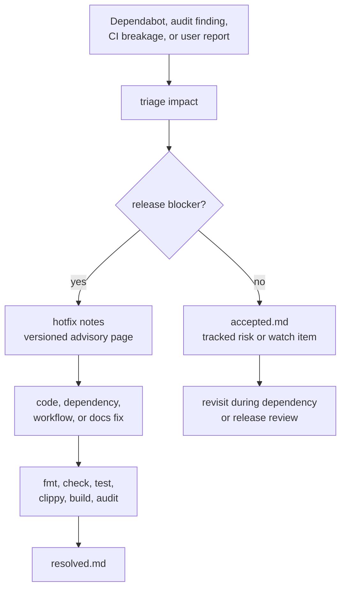

# Advisories

This directory records GhostCTL hotfix notes, accepted risks, and resolved
advisories. It is intentionally lightweight: release-critical evidence belongs
here when it helps operators understand why a hotfix shipped and what was
validated.

## Advisory Flow

## Current Pages

| Page | Purpose |
|------|---------|
| [v0.12.1-hotfix-notes.md](v0.12.1-hotfix-notes.md) | Dependency and workflow hotfix notes for v0.12.1 |
| [accepted.md](accepted.md) | Accepted risks and operational watch items |
| [resolved.md](resolved.md) | Resolved advisory and hotfix history |

## Policy

- Keep advisory notes factual and tied to evidence.
- Prefer exact versions, dates, command names, and validation results.
- Avoid duplicating the full changelog; link back to hotfix notes when needed.
- Record operational caveats separately from code defects.
