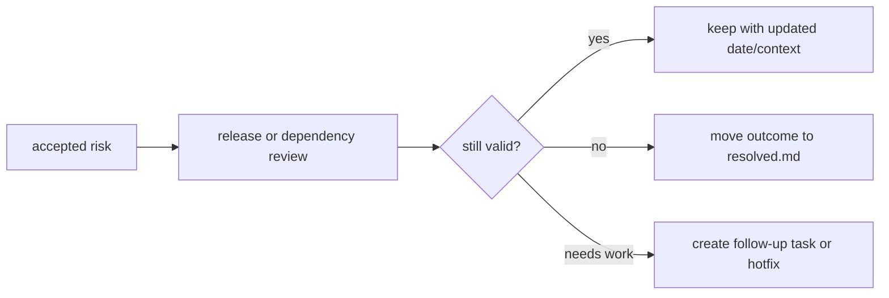

# Accepted Risks

Accepted risks are known operational constraints or follow-up items that do not
block the current release. They should be reviewed before each tagged release.

## Current Accepted Items

| Item | Status | Rationale | Review Trigger |
|------|--------|-----------|----------------|
| Self-hosted GitHub runner version is managed outside this repo | Accepted | Node 24-based actions require runner `>= 2.327.1`; the runner is a Docker stack and will be maintained operationally. The workflows document the requirement, but cannot preflight it before `actions/checkout`. | Before publishing releases that depend on upgraded GitHub Actions |
| `cargo-outdated` not installed in the local maintainer environment | Accepted | `cargo update` and `cargo audit` covered the hotfix requirement. `cargo-outdated` is useful optional tooling, not a release blocker. | When formalizing maintainer tooling bootstrap |

## Review Flow

