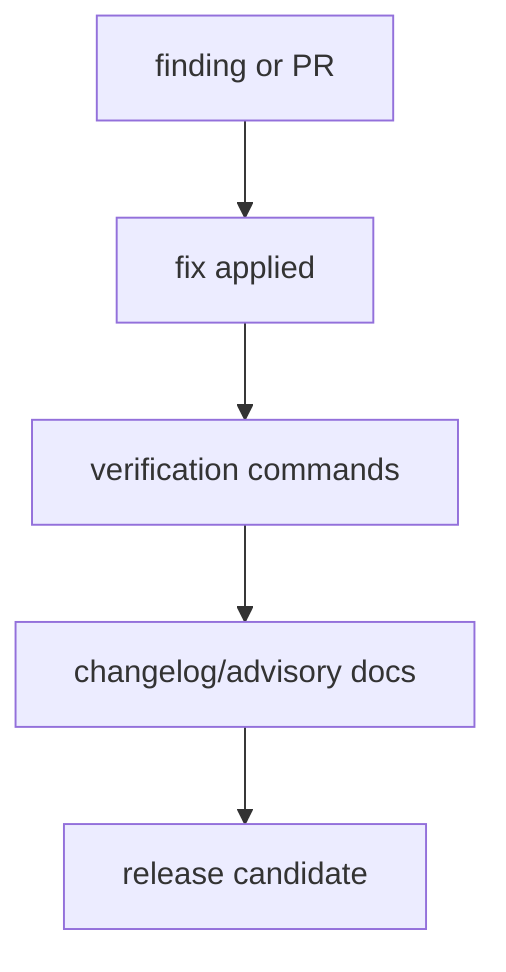

# Resolved Advisories

This file records advisory-class items that were fixed or intentionally closed.

## Resolved Items

| Date | Version | Area | Resolution |
|------|---------|------|------------|
| 2026-06-24 | 0.12.1 | Cargo dependencies | Updated direct crates from the open Dependabot PRs and refreshed the lockfile with compatible transitive updates. |
| 2026-06-24 | 0.12.1 | RustSec audit | Ran `cargo audit`; no vulnerabilities were reported for the updated lockfile. |
| 2026-06-24 | 0.12.1 | GitHub Actions | Updated SHA-pinned action revisions from the grouped Dependabot PR and documented the Node 24 runner requirement. |
| 2026-06-24 | 0.12.1 | SHA digest rendering | Fixed `sha2` 0.11 digest output formatting by rendering digest bytes explicitly as lowercase hex. |
| 2026-06-24 | 0.12.1 | Zsh setup robustness | Replaced panics around missing `HOME` and failed `git` execution with clean error messages. |

## Resolution Flow

