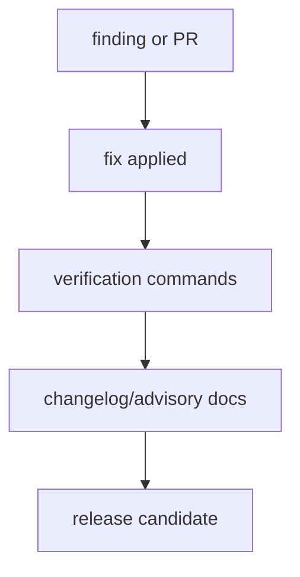

# Resolved Advisories

This file records advisory-class items that were fixed or intentionally closed.

## Resolved Items

| Date | Version | Area | Resolution |
|------|---------|------|------------|
| 2026-08-03 | 0.12.3 | Action pin drift | `release.yml` pinned `Swatinem/rust-cache` to an unreleased intermediate commit while its `# SHA pin:` comment claimed `v2.9.1`. Repinned to the real `v2.9.1` tag and re-verified every workflow pin against its upstream tag. |
| 2026-08-03 | 0.12.3 | Cargo dependencies | Refreshed the lockfile with compatible updates across 83 crates, superseding the grouped Dependabot PR. |
| 2026-08-03 | 0.12.3 | RustSec audit | Ran `cargo audit`; no advisories across the 456 resolved dependencies. |
| 2026-08-03 | 0.12.3 | GitHub Actions | Updated `actions/checkout` to `v7.0.1` and `softprops/action-gh-release` to `v3.0.2`, refreshing the `# SHA pin:` comments Dependabot leaves stale. |
| 2026-06-24 | 0.12.1 | Cargo dependencies | Updated direct crates from the open Dependabot PRs and refreshed the lockfile with compatible transitive updates. |
| 2026-06-24 | 0.12.1 | RustSec audit | Ran `cargo audit`; no vulnerabilities were reported for the updated lockfile. |
| 2026-06-24 | 0.12.1 | GitHub Actions | Updated SHA-pinned action revisions from the grouped Dependabot PR and documented the Node 24 runner requirement. |
| 2026-06-24 | 0.12.1 | SHA digest rendering | Fixed `sha2` 0.11 digest output formatting by rendering digest bytes explicitly as lowercase hex. |
| 2026-06-24 | 0.12.1 | Zsh setup robustness | Replaced panics around missing `HOME` and failed `git` execution with clean error messages. |

## Resolution Flow

```mermaid
flowchart TD
    finding["finding or PR"] --> fix["fix applied"]
    fix --> verify["verification commands"]
    verify --> docs["changelog/advisory docs"]
    docs --> release["release candidate"]
```
