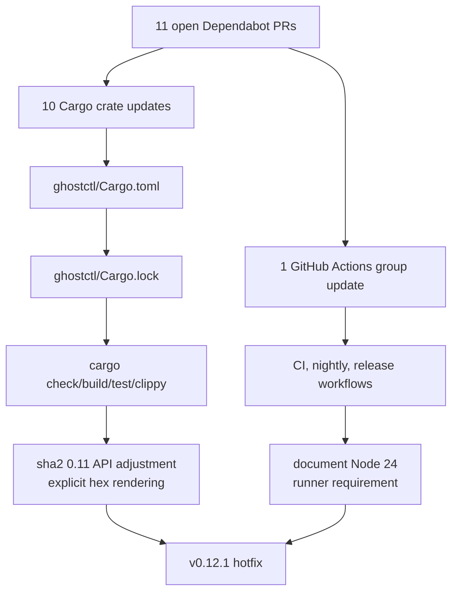
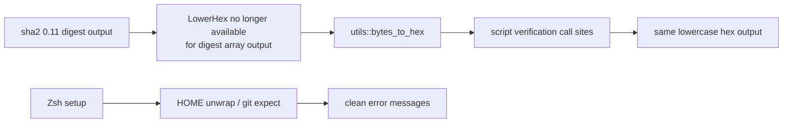
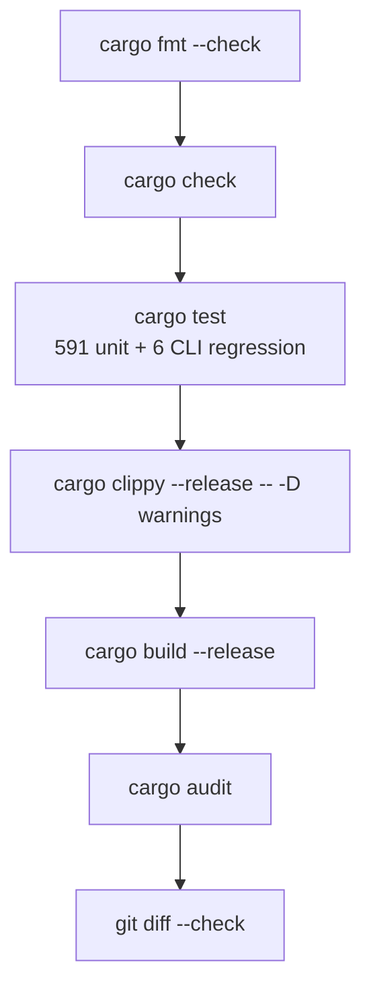

# v0.12.1 Hotfix Notes

Date: 2026-06-24

v0.12.1 is a maintenance hotfix focused on dependency updates, workflow pin
updates, release metadata alignment, and small robustness fixes discovered while
validating the updated dependency graph.

## Scope



## Cargo Updates

Direct crate requirements updated:

| Crate | Hotfix Requirement |
|-------|--------------------|
| `crossterm` | `0.29` |
| `duct` | `1.1` |
| `gethostname` | `1.1` |
| `libloading` | `0.9` |
| `nix` | `0.29` |
| `sha1` | `0.11` |
| `sha2` | `0.11` |
| `sysinfo` | `0.39` |
| `toml` | `1.1.2` |
| `which` | `8.0` |

`Cargo.lock` was regenerated with `cargo update`, which also pulled compatible
transitive updates.

## Workflow Updates

The grouped GitHub Actions update refreshed SHA-pinned actions in:

- `.github/workflows/ci.yml`
- `.github/workflows/nightly.yml`
- `.github/workflows/release.yml`

Operational caveat: the upgraded actions use the Node 24 runtime. Self-hosted
runner images must provide GitHub Actions runner `2.327.1` or newer.

## Fixes



- Added `utils::bytes_to_hex` and replaced direct `format!("{:x}", hasher.finalize())`
  call sites used by script verification flows.
- Replaced Zsh setup panics with user-facing failure messages for missing `HOME`
  and failed `git` execution.

## Verification



Commands run for the hotfix:

```bash
cargo fmt --check
cargo check
cargo test
cargo clippy --release -- -D warnings
cargo build --release
cargo audit
git diff --check
```

`cargo-outdated` was not installed in the local environment and was not treated
as a release blocker.
