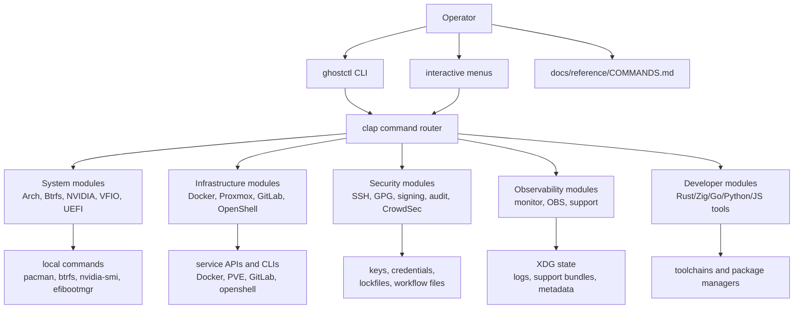
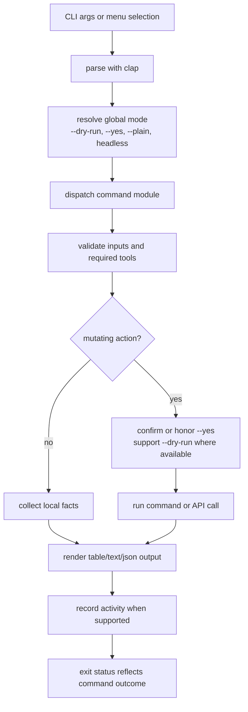
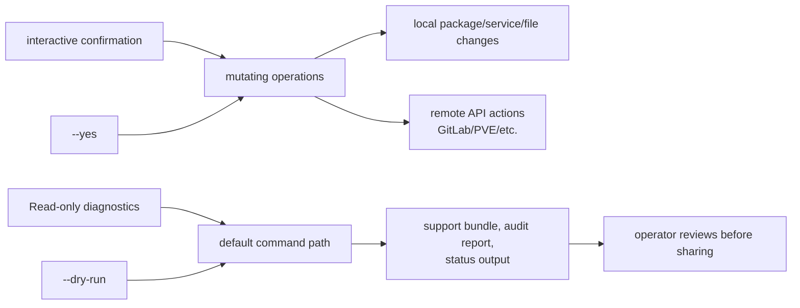
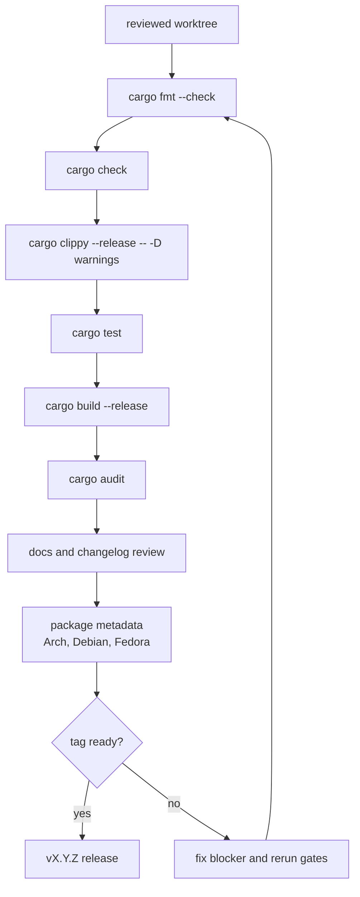

# GhostCTL Architecture

GhostCTL is a single Rust CLI that routes operational workflows across Linux
system administration domains. The command surface is broad, but the runtime
shape is intentionally simple: parse command intent, collect local context,
call the smallest necessary local tool or API, and write evidence to XDG state
paths when a workflow needs support or audit artifacts.

## System Map

## Command Execution Model

## Safety Boundaries

## Documentation Map

```mermaid
flowchart TD
    start["Start here"] --> index["docs/README.md"]
    index --> install["deployment/INSTALL.md"]
    index --> commands["reference/COMMANDS.md"]
    index --> support["support/README.md"]

    index --> system["System management"]
    system --> arch["arch/README.md"]
    system --> btrfs["btrfs/README.md"]
    system --> nvidia["nvidia/README.md"]
    system --> virt["virtualization/README.md"]

    index --> infra["Infrastructure"]
    infra --> docker["docker/README.md"]
    infra --> proxmox["proxmox/README.md"]
    infra --> gitlab["gitlab/gitlab.md"]
    infra --> openshell["openshell/openshell.md"]

    index --> security["Security and audit"]
    security --> security_index["security/README.md"]
    security --> deps["security/dependency-audit.md"]
    security --> ci["security/ci-workflow-audit.md"]
    security --> package["security/package-audit.md"]
    security --> signing["signing/README.md"]

    index --> ops["Observability and desktop"]
    ops --> monitor["monitor/monitoring.md"]
    ops --> obs["obs/wayland-screencapture.md"]
```

## Release Gate Shape

## Design Notes

| Area | Policy |
|------|--------|
| Output | Human-readable by default; JSON where automation needs it |
| State | XDG config/data/state paths, with support artifacts under state |
| External tools | Checked before use where practical; failures should be reported, not panicked |
| Mutations | Prefer confirmation, `--dry-run`, and explicit user intent |
| Security | Favor pinned workflow actions, lockfile-based audits, and local parsing before remote calls |
