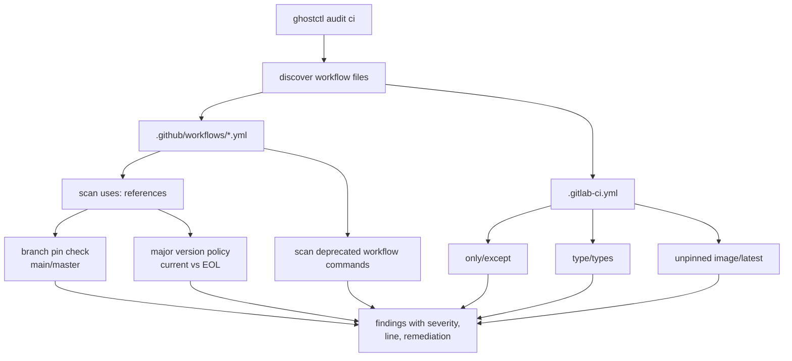
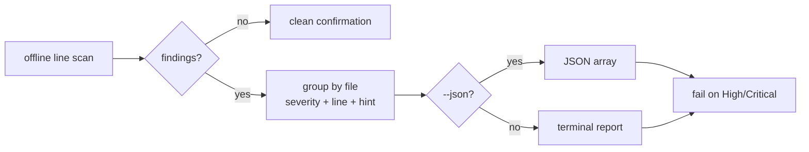

# CI/CD Workflow Audit

`ghostctl audit ci` is an offline auditor for CI/CD workflow files. It scans
GitHub Actions workflows (`.github/workflows/*.yml`) and GitLab CI
(`.gitlab-ci.yml`) for deprecated and outdated constructs against a curated,
deterministic table. There is no network call and no YAML dependency — files are
line-scanned — so results are reproducible and the checks are unit-tested.
Findings are advisory: heuristics flag suspicion, not proof.

## Quick Commands

```bash
ghostctl audit ci            # Scan the current repository's workflows
ghostctl audit ci ./path     # Scan a repository elsewhere
ghostctl audit ci --json     # Machine-readable output (exit 1 on High/Critical)
```

The optional positional argument is the repository root (default: the current
directory). The command errors if neither `.github/workflows/*.yml` nor
`.gitlab-ci.yml` is found.

## GitHub Actions Checks



| Rule | Severity | Detects |
|------|----------|---------|
| `outdated-action` | High / Medium | An action pinned to a major version older than the curated current major. **High** if the major is at or below the action's end-of-life major, otherwise **Medium**. |
| `unpinned-action` | Medium | An action pinned to a moving branch (`@main` / `@master`) instead of a released tag or commit SHA. |
| `deprecated-runner-command` | High / Medium | Deprecated workflow commands: `::set-output` / `::save-state` (Medium) and `::set-env` / `::add-path` (High — these were disabled for security). |

The action version policy covers common actions including `actions/checkout`,
`actions/setup-*`, `actions/upload-artifact` / `download-artifact`,
`actions/cache`, `actions/github-script`, `github/codeql-action`, the
`docker/*` build actions, `codecov/codecov-action`, and `Swatinem/rust-cache`.
Each entry tracks the current recommended major and the highest end-of-life
major.

## GitLab CI Checks

| Rule | Severity | Detects |
|------|----------|---------|
| `gitlab-only-except` | Medium | `only:` / `except:` job conditions, deprecated in favour of `rules:`. |
| `gitlab-type` | Medium | `type:` / `types:` keywords, deprecated in favour of `stage:`. |
| `unpinned-image` | Medium | A container `image:` with no tag, or `:latest`. |

## Output and Exit Codes



The default output groups findings by file with severity, line number, message,
and a remediation hint. A clean scan prints a confirmation. `--json` emits a JSON
array for pipelines.

The command exits non-zero when any **High** or **Critical** finding is present
and the run is non-interactive (or `--json` is set), so it can gate a pipeline.

## See Also

- [Dependency Vulnerability Audit](dependency-audit.md) — `ghostctl audit cargo|node|deps`
- [GitLab](../gitlab/gitlab.md) — `ghostctl gitlab ci-lint` validates a CI file against the live API
